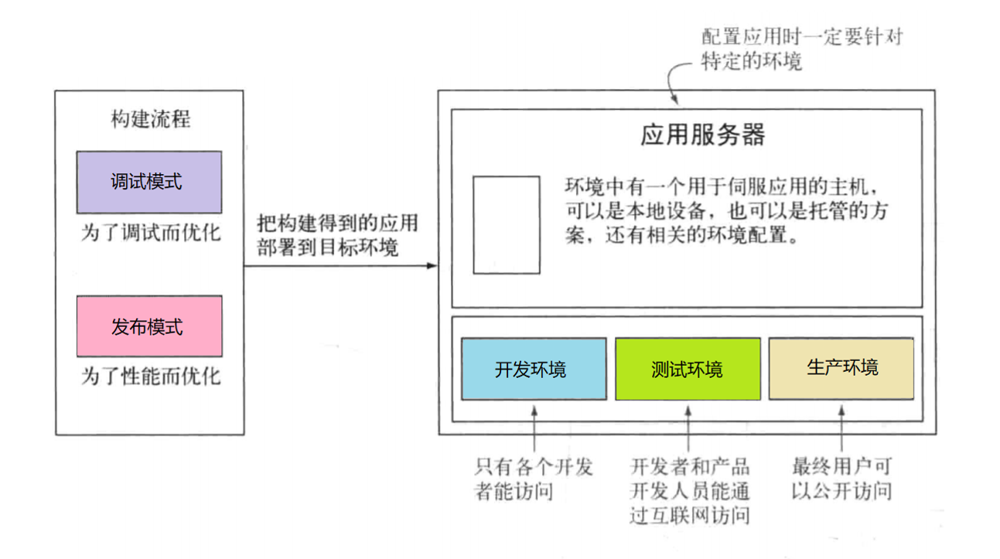
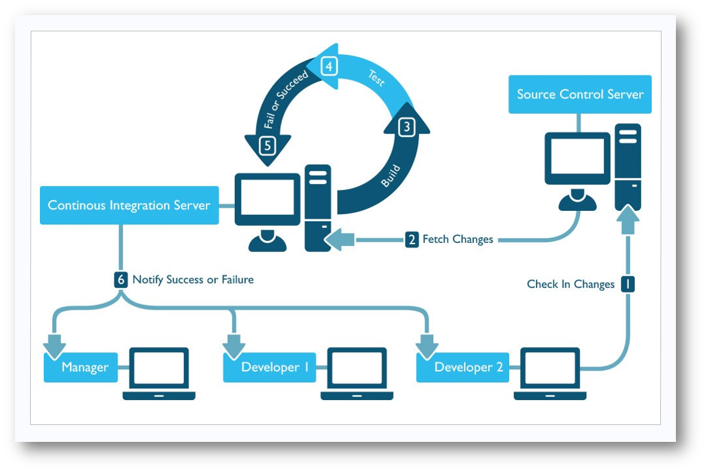

## 02-1 自动化构建概述 (构建优先)

+ 脚手架：本质上脚手架是代码，不是应用程序的功能，也不时应用程序的组成部分，主要负责完成前端程序自动化的构建。（多体现在命令上，比如`create-react-app`命令）

+ 框架：框架是程序的一部分，完成程序的功能，主要为了方便组织安排功能模块

自动化构建输入的程序的代码，输出的是程序的软件

**构建优先的原因：**代码风格更加规范，代码性能更好，。。。。。。

版本控制系统，持续集成系统

### 构建的模式和环境

#### 1、三种环境：

开发环境（development）、过渡环境（staging）、生产环境（production）



#### 2、两个模式：调试模式（debug），发布模式（release）


**自动化任务工具：**

GRUNT  ;   gulp.js  ;  webpack

**持续集成工具:**

- Travis CI:

> node.js 项目，Travis-CI 自动执行两个脚本：
>
> - npm install
> - npm test
>
> 注意：npm test 默认脚本 “exit 1” 改成 "exit 0" 否则自动化构建会失败，后续脚本不会执行

- Jenkins

**自动化构建需要用到三项技术**：

+ 配置管理（SVN/GIT）
+ 任务的调度（npm/grunt/gulp.js）
+ 持续集成



### 案例体现：构建GitBook

+ 在`GitHub`中创建`GitBook`仓库，注意选择`MIT`协议、`node`版本的`.gitignore`文件

+ 在本地仓库中编写文件

```bash
~/GitBook(master) » vim ch01.md ch02.md SUMMARY.md

~/GitBook(master) » cat SUMMARY.md                               
- [简介](README.md)
- [第一章](ch01.md)
- [第二章](ch02.md)
- [第三章](ch03.md)

~/GitBook(master) » npm i -g gitbook-cli # 安装gitbook脚手架

~/GitBook(master) » gitbook build # 创建gitbook 会生成_book目录 在_book目录下lrd能访问电子书  把md文件转化为html
```

+ 利用分支生成`GitHub Pages` ---**手动构建**

```bash
~/GitBook(master) » 清空临时目录 tmp
~/GitBook(master) » mv _book ~/tmp 将文件夹移动到临时目录
~/GitBook(master) » 上传到仓库 git add .
~/GitBook(master) » git commit -m 'push'
~/GitBook(master) » git push
~/GitBook(master) » git checkout -b gh-pages 创建分支
~/GitBook(gh-pages) » cp -r ~/tmp/_book/* . 拷贝到分支
~/GitBook(gh-pages) » git add -A
~/GitBook(gh-pages) » git commit -m "book v0.1 publish"
~/GitBook(gh-pages) » gp -u origin gh-pages 
```

+ 利用**自动构建**生成`GitHub Pages`

在`master`分支下编写`.travis.yml`

```yml
language: node_js
node_js:
    - "node"

after_script:
  - gitbook build
  - cd ./_book
  - git init
  - git config user.name "${USER_NAME}"
  - git config user.email "${USER_EMAIL}"
  - git add .
  - git commit -m "publish gitbook"
  - git push --force --quiet "https://${ACC_TOKEN}@${GH_REF}" master:${BRANCH}

branches:
  only:
    - master
```

在`master`分支下编写`package.json`

```json
{
  "name": "gitbook",
  "version": "1.0.0",
  "description": "在线电子书",
  "main": "index.js",
  "scripts": {
    "test": "echo \"Error: no test specified\" && exit 0"
  },
  "repository": {
    "type": "git",
    "url": "git+https://github.com/wangding/GitBook.git"
  },
  "author": "wangding",
  "license": "MIT",
  "bugs": {
    "url": "https://github.com/wangding/GitBook/issues"
  },
  "homepage": "https://github.com/wangding /GitBook#readme",
  "devDependencies": {
    "gitbook-cli": "^2.3.2"             
  }
}
```

`travisCI` 持续集成 `gh-page` 并部署：https://segmentfault.com/a/1190000015274243

```txt
ACC_TOKEN: d5433f9ab6a0ca4bda017b5(用自己的)
BRANCH: gh-pages
GH_REF: github.com/wangding/{repos_name}
USER_EMAIL: 408542507@qq.com
USER_NAME: wangding
```

部署成功后访问`GitHub Pages`

```bash
~/GitBook(master) » vim ch03.md SUMMARY.md
~/GitBook(master) » git add -A
~/GitBook(master) » git commit -m "book v0.2"
~/GitBook(master) » git push
```

在这个过程中的`git`相关的操作

+ 版本回退：`git reset HEAD^ --hard` `git reset --hard 5a4090 `

+ 分支操作：`git checkout -b gh-pages`         `git branch -D gh-pages`
+ 如果让`github`上的仓库和本地的一致 `git push -f -u`