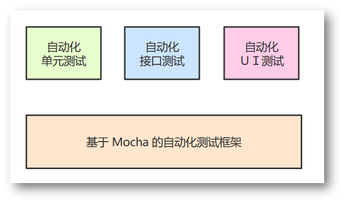

## 02-3 单元测试

测试的对象是程序。

程序的错误有三种：语法错误、逻辑错误和运行时错误。

软件测试理论体系中，将软件测试分为两类：

+ 按是否执行被测程序，分为：静态测试和动态测试。静态测试不运行程序，动态测试需要运行被测程序。
+ 按是否查看程序代码，分为：黑盒测试和白盒测试。黑盒测试不需要查看被测程序的代码，而白盒测试需要查看程序代码。

单元测试（`unit testing`），是指对软件中的最小可测试单元进行检查和验证。对于单元测试中单元的含义，一般指一个**函数**或者一个**类里面的方法**，单元就是人为规定的最小的被测功能模块。单元测试是在软件开发过程中要进行的最低级别的测试活动，软件的独立单元将在与程序的其他部分相隔离的情况下进行测试。




代码覆盖率：

+ 行覆盖率（line coverage）：是否每一行都执行了？
+ 函数覆盖率（function coverage）：是否每个函数都调用了？
+ 分支覆盖率（branch coverage）：是否每个if代码块都执行了？
+ 语句覆盖率（statement coverage）：是否每个语句都执行了？

单元测试的三个核心技术点：

- 设计可测代码
- 测试用例
- 隔离依赖

单元测试第三方库：

- 自动化测试框架：Mocha
- 断言库：chai
- 测试覆盖：istanbul
- 测试辅助：sinon

### 案例体现：服务端代码单元测试 

- 在 grunt-demo 仓库，创建 mocha-be 分支
- 创建被测模块 add.js，被测模块暴露出 add 方法，实现 z = x + y
- 对 add.js 模块，编写 mocha 单元测试脚本
- 执行 mocha 命令，运行单元测试，查看单元测试输出结果
- 进行代码覆盖率测试，查看代码覆盖率报告
- 添加 grunt 插件支持，实现 grunt mocha 单元测试，添加 grunt 插件支持，实现 grunt 代码覆盖率测试    grunt-mocha-cli

```bash
# 1. 编写被测模块sum.js 在sum.js中暴露出add方法 并且该方法在add.js中引入

# 2. 对add.js编写测试脚本文件sum.test.js 

# 3. 安装插件，并且执行mocha命令查看单元测试结果
~/grunt-demo(mocha-be) » npm i -D grunt grunt-mocha mocha chai
------------------------------------------------------------
~/grunt-demo(mocha-be) » mocha
  加法函数的测试
    ✓ 0 + 0 = 0
    ✓ 1 + 0 = 1
    ✓ "1" + "0" = "1"
    ✓ 20 + 5 = 25
  4 passing (12ms)
  
# 4. 查看代码覆盖率
~/grunt-demo(mocha-be*) » node_modules/.bin/istanbul cover app.js 1 2
1 + 2 = 3
=============================================================================
Writing coverage object [/home/wangding/grunt-demo/coverage/coverage.json]
Writing coverage reports at [/home/wangding/grunt-demo/coverage]
=============================================================================

=============================== Coverage summary ===============================
Statements   : 100% ( 6/6 )
Branches     : 50% ( 2/4 )
Functions    : 100% ( 1/1 )
Lines        : 100% ( 6/6 )
================================================================================
# 5. 查看代码覆盖率报告
~/grunt-demo/coverage(mocha-be*) » cd lcov-report
------------------------------------------------------------
~/grunt-demo/coverage/lcov-report(mocha-be*) » lrd
# 6. 执行grunt进行自动化构建
~/grunt-demo(mocha-be*) » grunt cover
Running "mocha_istanbul:coverage" (mocha_istanbul) task


  加法函数的测试
    ✓ 0 + 0 = 0
    ✓ 1 + 0 = 1
    ✓ "1" + "0" = "1"
    ✓ 20 + 5 = 25


  4 passing (18ms)

=============================================================================
Writing coverage object [/home/wangding/grunt-demo/coverage/coverage.json]
Writing coverage reports at [/home/wangding/grunt-demo/coverage]
=============================================================================

=============================== Coverage summary ===============================
Statements   : 100% ( 3/3 )
Branches     : 100% ( 0/0 )
Functions    : 100% ( 1/1 )
Lines        : 100% ( 3/3 )
================================================================================
>> Done. Check coverage folder.

Done.
```


其中，`sum.js` `sum.test.js` `Gruntfile.js`文件显示如下：

```javascript
function add(x,y){
    return Number(x) + Number(y);
}
```

```js
var add = require('../sum');

var expect = require('chai').expect;

describe('加法函数的测试',function(){
  it('0 + 0 = 0',function(){
    expect(add(0,0)).to.be.equal(0);
  });
  it('1 + 0 = 1',function(){
    expect(add(1,0)).to.be.equal(1);
  });
  it('"1" + "0" = "1"',function(){
    expect(add('1','0')).to.be.equal(1);
  });
  it('20 + 5 = 25',function(){
    expect(add(20,5)).to.be.equal(25);
  })
});
```

```js
module.exports = function (grunt) {
  grunt.initConfig({
    mochacli: {
      options: {
        reporter: 'spec',
        bail: true
      },
      all: ['test/*.js']
    },
    mocha_istanbul: {
      coverage: {
        src: 'test'
      }
    },
    istanbul_check_coverage: {
      default: {
        options: {
          coverageFolder: 'coverage*',
          check: {
            lines: 90,
            statements: 90
          }
        }
      }
    }
  });

  grunt.loadNpmTasks('grunt-mocha-cli');
  grunt.loadNpmTasks('grunt-mocha-istanbul');

  grunt.registerTask('default', ['mochacli']);   
  grunt.registerTask('cover', ['mocha_istanbul']);
  grunt.registerTask('check-cover', ['istanbul_check_coverage']);
};
```

### 案例体现：前端代码单元测试

- 在 grunt-demo 仓库，创建 mocha-fe 分支
- 将 rectangle 仓库中的 index.html、rectangle.js 和 rectangle.css 三个代码文件复制到当前项目仓库的 mocha-fe 分支下
- 重构 rectangle.js 代码，使其易于实施单元测试
- 添加 mocha 单元测试代码
- 运行 grunt mocha 单元测试，查看单元测试输出结果 
- grunt插件：grunt-mocha

```bash
# 1. 重新编写rectangle.js代码 引入calc.js的方法 调用相关方法
function rectangle(){
  return {
    'perimeter':function(width,height){
      return 2*(Number(width) + Number(height));
    },
    'area':function(width,height){
      return Number(width)*Number(height);
    }
  };
}
# 2. 引入插件
~/grunt-demo(mocha-fe) » npm i -D grunt grunt-mocha mocha chai

# 3. 编写test文件夹下的文件
~/grunt-demo/test(mocha-fe) » tree
# 其中mocha.css mocha.js chai.js需要引入 node_modules/mocha/mocah.css 和 mocha.js
.
├── calc.test.js
├── chai.js
├── index.html
├── mocha.css
└── mocha.js
# 4. 在grunt-demo下执行lrd 在浏览器中输入http://192.168.80.122:8080/test
# 5. 执行grunt 执行自动化构建 在执行grunt之前 需要进行npm i操作
# 在npm i操作过程中有一个文件比较大 需要做如下操作
/tmp » mkdir phantomjs
------------------------------------------------------------
/tmp/phantomjs » tar -xf phantomjs-1.9.8-linux-x86_64.tar.bz2
------------------------------------------------------------
~/grunt-demo(mocha-fe*) » grunt
Running "mocha:test" (mocha) task
Testing: test/index.html

  
  ․․

  2 passing (105ms)

>> 2 passed! (0.10s)

Done.
```


其中，`rectangle.js`  `test/index.html`  `test/calc.test.js` `Gruntfile.js`文件显示如下：

```js
$(function(){
  var width = $('#width'),
      height = $('#height'),
      btnCal = $('#calculate'),
      perimeter = $('#perimeter'),
      area = $('#area');
  btnCal.click(function(){

    var w = Number(width.val()),
        h = Number(height.val());
    
    var rect = rectangle();
    perimeter.val(rect.perimeter(w,h));// 引入perimeter方法
    area.val(rect.area(w,h));// 引入area方法
  });
});
```

```html
<!DOCTYPE html>
<html>
  <head>
    <title>Mocha</title>
    <meta http-equiv="Content-Type" content="text/html; charset=UTF-8">
    <meta name="viewport" content="width=device-width, initial-scale=1.0">
    <link rel="stylesheet" href="mocha.css" />
  </head>
  <body>
    <div id="mocha"></div>
    <script src="../calc.js"></script>
    <script src="chai.js"></script>
    <script src="mocha.js"></script>
    <script>mocha.setup('bdd');</script>
    <script src="calc.test.js"></script>
    <script>
      if(navigator.userAgent.indexOf('PhantomJS') < 0) {
          mocha.run();
      }
    </script>
  </body>
</html>
```

```js
var expect = chai.expect;

describe('矩形面积函数的测试', function() {
  it('area(10, 5) = 50', function() {
    var r = rectangle();
    expect(r.area(10, 5)).to.be.equal(50);          
  });

  it('area("10", "5") = 50', function() {
    var r = rectangle();
    expect(r.area("10", "5")).to.be.equal(50);          
  });
});
```

```js
module.exports = function (grunt) {
  grunt.initConfig({
    mocha: {
      test: {
        src: ['test/index.html'],
      },
    options: {
      run: true,
      reporter: 'Dot'     
    }
    }
  });

  grunt.loadNpmTasks('grunt-mocha');

  grunt.registerTask('default', ['mocha']);
};
```

 #####  HTTP API接口测试：

> grunt插件：grunt-run

演示 Grunt 实现 HTTP API 接口测试，用到 grunt-mocha-cli 和 grunt-run 插件。

执行下面的命令：

```
git clone https://github.com/wangding/grunt-demo
git checkout http-api-test
npm install
grunt
```

运行 grunt 命令会执行以下三个构建任务：

- 启动 HTTP API web 服务
- 对 API 做单元接口测试
- 关闭 HTTP API web 服务

```javascript
module.exports = function (grunt) {
    grunt.initConfig({
        run: {
          api: {
            options: { wait: false },
            args: ['./app.js']
          }
        },
        mochacli: {
          options: {
            reporter: 'spec',
            bail: true
          },
            all: ['test/*.js']
        }
      });

  grunt.loadNpmTasks('grunt-run')
  grunt.loadNpmTasks('grunt-mocha-cli')

  grunt.registerTask('default', ['run', 'mochacli', 'stop:api']);
};
```

#### 单元测试总结：

消除依赖、代码重构、测试用例设计、单元测试代码套路

#### entropy 的单元测试

- 在 grunt-demo 仓库，创建 entropy 分支
- 获取 [entropy.js](https://github.com/wangding/nodejs-demo/blob/master/24-project/entropy.js) 被测程序
- entropy 程序的功能描述，请参考 [Node.js 大作业](https://nodejs.wangding.in/chapters/ch14-project.html)
- 重构 entropy.js 代码，使其易于实施单元测试
- 添加 mocha 单元测试代码
- 运行 grunt mocha 单元测试，查看单元测试输出结果
- 查看代码覆盖率报告