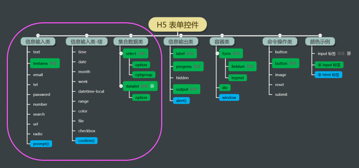
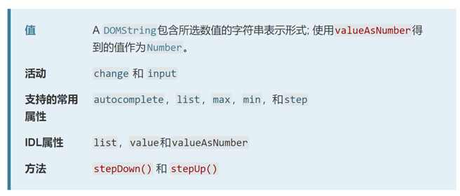
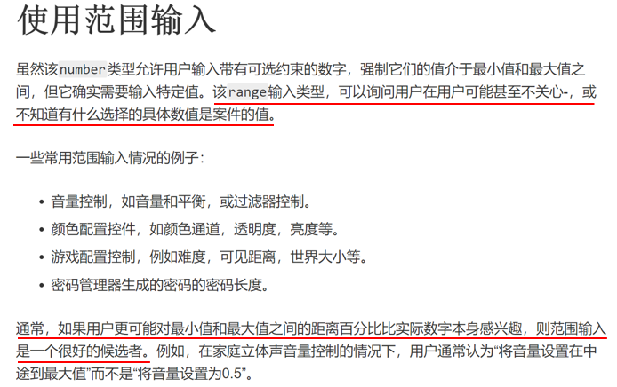

## H5表单控件

+ 可以按照表示的信息对H5表单控件进行分类：


+ 同样H5表单控件可以按照控件信息的输入、输出和操作等功能分类



注意，输入类的控件一般同时可以用来输出，例如：矩形计算器中，面积和周长数据的输出用的是文本框。

但是输入类的控件一般会以输入信息为主要用途，用于输出，需要特别考虑一下，是否合适，当然，还需要设置控件 disable，屏蔽输入功能。输出类的控件只能输出，没有任何歧义。

容器类的控件 page 相当于 HTML 标签中的 body，代表整个页面


控件三要素：属性、方法、事件

### 阅读参考资料

+ 这篇文章对表单控件的MDN文档进行了整理：https://spa.wangding.in/task04.html

举例说明：

`<input type="range"/>`

对于这样一个表单控件需要了解一下几方面的内容：

1. 明确这个表单控件的功能是什么，在HTML页面中展示的样子是什么
2. 知道这个表单控件所对应的属性值有哪些
3. 知道这个表单控件能够触发哪些事件，这些事件有哪些区别
4. 这个表单控件能够应用的范围有哪些，一般在实际生活中如何使用





### 定时器按钮

基本要求：

- 创建 10-timer-button 目录
- 使用 H5 内置控件实现
- 按钮初始状态为禁用
- 禁用状态下，点击按钮，不会有任何响应
- 倒计时 6 秒
- 每隔一秒按钮文字显示剩余秒数
- 倒计时结束后，按钮状态为启用
- 启用状态下，点击按钮，会弹出 alert 弹框

代码参考：

``````html 
<!DOCTYPE html>
<html lang="en">
<head>
  <meta charset="UTF-8">
  <title>button</title>
  <link rel="stylesheet" href="layout.css">
  <link rel="icon" href="https://i.wangding.in/favicon.ico" sizes="48x48" type="image/png">
</head>
<body>
  <input type="button" value="同意(6s)" disabled/>
  <script src="//apps.bdimg.com/libs/jquery/2.1.4/jquery.min.js"></script>
  <script src="main.js"></script>
</body>
</html>
``````

``````javascript
$(function(){
  var n = 6;
  var $btnAgree = $('input[type="button"]');

  var timer = window.setInterval(function(){
    n--;
    if(n === 0){
      window.clearInterval(timer);
      $btnAgree.removeAttr('disabled');
      $btnAgree.val('同意');
    } else {
      $btnAgree.val('同意('+ n + 's)');
    }
  },1000);

  $btnAgree.click(function(){
    alert('thank you');
  });
});
``````

### 密码可见

基本要求：

- 创建 11-password-visual 目录
- 使用 H5 内置控件实现
- 在文本框中输入任意字符，并不显示输入的字符，而显示为“点”（隐藏密码）
- 文本框的右侧有眼睛闭合的图标
- 当鼠标移到眼睛图标时
- 密码框中的密码可以正常显示
- 眼睛关闭的图标变成眼睛睁开的图标
- 当鼠标移出眼睛图标时
- 密码框中的密码不可见
- 眼睛睁开的图标变成眼睛闭合的图标
- 密码框设置为初始焦点

代码参考：

``````html
<!DOCTYPE html>
<html lang="en">
<head>
  <meta charset="UTF-8">
  <title>hello</title>
  <link rel="stylesheet" href="layout.css">
  <link rel="icon" href="https://i.wangding.in/favicon.ico" sizes="48x48" type="image/png">
</head>
<body>
  <div>
    <label for="passwd">密码：</label>
    <input type="password" id="passwd"/>
    <span></span>
  </div>
  <script src="//apps.bdimg.com/libs/jquery/2.1.4/jquery.min.js"></script>
  <script src="main.js"></script>
</body>
</html>
``````

``````js
$(function(){
  var $pwd = $('input[type="password"]');
  var $span = $('span img');

  $span.mouseover(function(){
    $span.attr('src','images/pwdulook.png');
    $pwd.attr('type','text');
  });

  $span.mouseout(function(){
    $span.attr('src','images/pwdlook.png');
    $pwd.attr('type','password');
  });
});
``````

### 滑杆

基本要求：

- 创建 12-range 目录
- 使用 H5 内置控件实现
- 用滑杆控件输入自己的年龄，滑杆的最小值为 0，最大值为 100
- 滑块拖动后，下方显示年龄数据
- 初始滑块位于最左边，下方的年龄数据为 0 岁

代码参考：

``````js
<!DOCTYPE html>
<html lang="en">
<head>
  <meta charset="UTF-8">
  <title>range</title>
  <link rel="stylesheet" href="layout.css">
  <link rel="icon" href="https://i.wangding.in/favicon.ico" sizes="48x48" type="image/png">
</head>
<body>
  <div>
    <label for="">年龄</label>
    <input type="range" value="0" min="0" max="100" step="1"/>
    <br/>
    <span>你的年龄是：</span>
    <span id="age">0</span>
    <span>岁</span>
  </div>
  <script src="//apps.bdimg.com/libs/jquery/2.1.4/jquery.min.js"></script>
  <script src="main.js"></script>
</body>
</html>
``````

``````js
$(function(){
  var $range = $('input[type="range"]');
  var $txtAge = $('#age');

  $range.on('input',function(){
    $txtAge.text($range.val());
  });
});
``````


### 进度条

基本要求：

- 创建 13-progress 目录
- 使用 H5 内置控件实现
- 用进度条控件模拟下载文件的进度
- 进度条控件下方有三个按钮：开始、暂停和重置
- 开始按钮点击后，进度条显示下载进度
- 暂停按钮点击后，下载进度暂停
- 重置按钮点击后，下载进度条恢复初始状态
- 多次点击开始按钮，点击一次暂停按钮，要求进度条能够暂停

代码参考：

``````html
<!DOCTYPE html>
<html lang="en">
<head>
  <meta charset="UTF-8">
  <title>progress</title>
  <link rel="stylesheet" href="layout.css">
  <link rel="icon" href="https://i.wangding.in/favicon.ico" sizes="48x48" type="image/png">
</head>
<body>
  <div>
    <label for="">下载进度：</label>
    <progress value="0" max="100" min="0" step="1"></progress>
    <br/>
    <input type="button" value="开始" class="start"/>
    <input type="button" value="暂停" class="pause"/>
    <input type="button" value="重置" class="reset"/>
  </div>
  <script src="//apps.bdimg.com/libs/jquery/2.1.4/jquery.min.js"></script>
  <script src="main.js"></script>
</body>
</html>
``````

``````js
$(function(){
  var $progress = $('progress');
  var $start = $('.start');
  var $pause = $('.pause');
  var $reset = $('.reset');
  var timer,n = 0;

  $start.click(function(){
    timer = window.setInterval(function(){
      $progress.val(++n);
    },100);
  });
  $pause.click(function(){
    window.clearInterval(timer);
  });
  $reset.click(function(){
    $progress.val(0);
  });

});
``````

