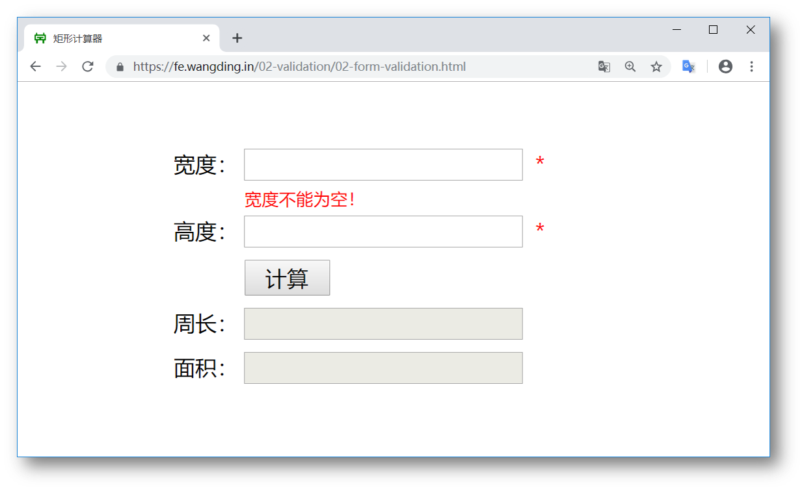
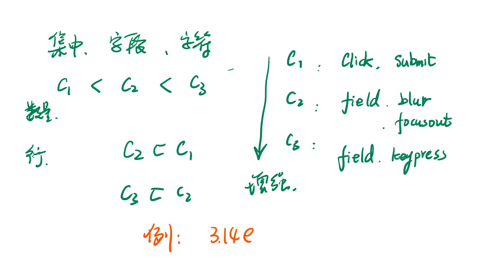
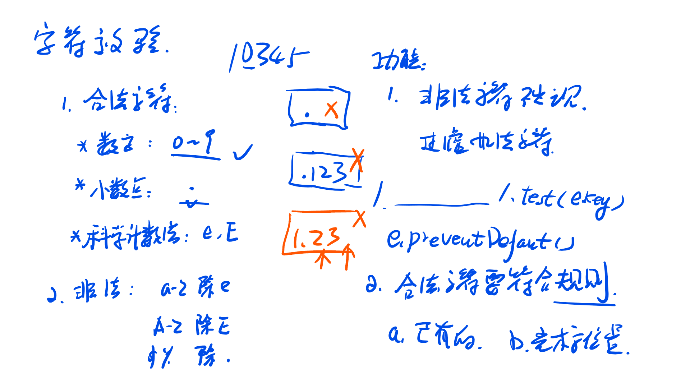
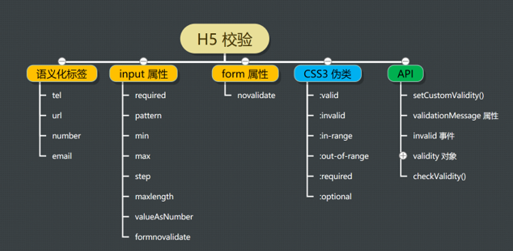

## 数据合法性校验



数据合法性校验主要分为客户端校验和服务端校验

校验的内容：

+ 是否为空值：就`rectangle`而言，宽度和高度不能为空值
+ 数据类型：就`rectangle`而言，宽度和高度应该是数值类型，不能是字符串
+ 数据取值范围：就`rectangle`而言，对于数值类型应该是正数或者为0，不能为负数
+ 数据模式：比如要填写一个`email`地址，看是否匹配`email`的格式

校验的分类：

+ 集中校验：比如当点击计算按钮，应该进行校验
+ 字段校验：在输入完宽度和高度之后，进行校验
+ 字符检验：在输入宽度和高度的一个字符之后，直接进行校验



上述图片可以看出：

+ 字符级校验> 字段级校验 > 集中校验
+ 字段级 = 集中校验 + 字段校验
+ 字符级 = 集中级 + 字段级 + 字符级（字符级是最高级的，而且字符级的校验应该建立在字段级的基础之上）

**校验方案：**

按校验执行的位置分类：

- 客户端校验
- 服务器端校验

按校验的颗粒度分类：

- 表单级校验
- 字段级校验
- 字符级校验

按校验代码的编写人分类：

- 自己验证
- H5 验证
- 混合验证

技术细节：

- 事件
  - submit 事件，集中校验
  - focusout 事件，字段校验
  - keypress 事件，字符检验
- 正则表达式
- 焦点和 Tab 键顺序
- H5 校验技术
  - 语义化标签
  - 验证属性
  - 伪类
  - validity API
  - setCustomeValidity API

### 表单级校验

基本要求：

- 做以下几个方面的校验：
  - 数据不能为空
  - 数据类型不对，数据不能是字符串，而应该是数字
  - 数据的取值范围错误，宽度和高度都应该大于零
- Tab 键进行焦点切换时不进行数据合法性验证
- 键盘输入字符时不对非法字符进行判断，不拦截非法字符
- 只有点击计算按钮时才进行数据合法性校验
- 出现验证错误时，只报告第一个验证的错误
- 只有数据验证都通过之后，才计算矩形的周长和面积

参考示例：

- [表单级验证](https://fe.wangding.in/02-validation/02-form-validation.html)

```js
/*
	说明：表单级验证只需要在用户点击计算按钮的时候进行空值 字符串 数据取值范围的验证即可，同时需要给表单添加两个div块
*/
# rectangle.js
/* global rectangle: true */
$(function(){
  var $width = $('#width'),
      $height = $('#height'),
      $btnCal = $('#calculate'),
      $perimeter = $('#perimeter'),
      $area = $('#area'),
      $widthValidation = $('#width-validation'),
      $heightValidation = $('#height-validation');

  $btnCal.click(function(){

    var w = $width.val(),
        h = $height.val();
    
    var widthResult = valid(w);
    var heightResult = valid(h);
    
    if(!widthResult.isOk){
      $widthValidation.html('宽度' + widthResult.reason);
      $width.select();
      return;
    }

    if(!heightResult.isOk){
      $heightValidation.html('高度' + heightResult.reason);
      $height.select();
      return;
    }

    $widthValidation.html('');
    $heightValidation.html('');

    var rect = rectangle();
    $perimeter.val(rect.perimeter(w,h));
    $area.val(rect.area(w,h));
  });

  $btnCal.mousedown(function(e){// 当点击事件和失去焦点事件冲突的时候触发
    e.preventDefault();
  });
});

# calc.js
function valid(data){
  var result = {
    isOk:false,
    reason:''
  };
  
  if(data === ''){
    result.reason = '不能为空';
    return result;
  }

  if(Number(data) < 0){
    result.reason = '不能为负数';
    return result;
  }

  if(!/^-?(0|[1-9]\d*)(\.\d*)?([eE][+-]?\d+)?$/.test(data)){
    result.reason = '不是合法数字';
    return result;
  }

  result.isOk = true;
  return result;
}
```

### 字段级校验

基本要求：

- 对矩形的宽度和高度两个字段进行字段级数据合法性校验
- 数据合法性校验的方面跟表单级验证相同
- 对非法数据提供清晰明确的错误提示
- 初始焦点在宽度文本框上，按 Tab 键时，进行数据合法性校验
- 如果数据不合法，Tab 键不移动到下一个文本框
- 如果宽度和高度是错误的（上面三种错误的任意一种），点击计算按钮（可以点击多次），不应该计算出周长和面积
- 对数据合法性校验模块增加单元测试

示例参考：

- [矩形计算器 v1.0 字段级校验](https://github.com/wangding/rectangle/commit/e8acaf597de40fdb8ec3ca32ec0a7c965b9bee41)

```js
/*
	需要在宽度和高度失去焦点的时候添加数据校验事件
*/
# rectangle.js
/* global rectangle: true */
$(function(){
  var $width = $('#width'),
      $height = $('#height'),
      $btnCal = $('#calculate'),
      $perimeter = $('#perimeter'),
      $area = $('#area'),
      $widthValidation = $('#width-validation'),
      $heightValidation = $('#height-validation');

  $width.focusout(function(){
    var w = $width.val();

    var result = valid(w);
    if(!result.isOk){
      $widthValidation.html('宽度' + result.reason);
      $width.select();
      return;
    }
    $widthValidation.html('');
  });

  $height.focusout(function(){
    var h = $height.val();

    var result = valid(h);
    if(!result.isOk){
      $heightValidation.html('高度' + result.reason);
      $height.select();
      return;
    } 
    $heightValidation.html('');
  });
  $btnCal.click(function(){

    var w = $width.val(),
        h = $height.val();
    
    var widthResult = valid(w);
    var heightResult = valid(h);
    
    if(!widthResult.isOk){
      $widthValidation.html('宽度' + widthResult.reason);
      $width.select();
      return;
    }

    if(!heightResult.isOk){
      $heightValidation.html('高度' + heightResult.reason);
      $height.select();
      return;
    }

    $widthValidation.html('');
    $heightValidation.html('');

    var rect = rectangle();
    $perimeter.val(rect.perimeter(w,h));
    $area.val(rect.area(w,h));
  });

  $btnCal.mousedown(function(e){// 当点击事件和失去焦点事件冲突的时候触发
    e.preventDefault();
  });
});
```

### 字符级校验

如何进行字符级校验：



基本要求：

- 在字段级验证的基础上添加字符级验证
- 合法的字符包括：0~9 十个数字、小数点、负号和科学计数法的 e 和 E
- 非法字符，除了上面合法字符以外的字母和标点符号
- 在矩形的宽度和高度输入框中输入非法字符，非法字符不会出现在文本框中
- 对字符过滤模块增加单元测试

参考示例：

- [矩形计算器 v1.1 字符级校验](https://wangding.github.io/rectangle/)

```js
/*
	说明：需要给字符添加keypress事件 并检验输入的字符的内容是否合法
*/
# rectangle.js
/* global rectangle: true */
$(function(){
  var $width = $('#width'),
      $height = $('#height'),
      $btnCal = $('#calculate'),
      $perimeter = $('#perimeter'),
      $area = $('#area'),
      $widthValidation = $('#width-validation'),
      $heightValidation = $('#height-validation');
  
  $width.keypress(function(e){
    if(!isLegalKey(e.key,e.target.value,e.target.selectionStart)){
      e.preventDefault();
    }
  });

  $width.focusout(function(){
    var w = $width.val();

    var result = valid(w);
    if(!result.isOk){
      $widthValidation.html('宽度' + result.reason);
      $width.select();
      return;
    }
    $widthValidation.html('');
  });

  $height.keypress(function(e){
    if(!isLegalKey(e.key,e.target.value,e.target.selectionStart)){
      e.preventDefault();
    }
  });

  $height.focusout(function(){
    var h = $height.val();

    var result = valid(h);
    if(!result.isOk){
      $heightValidation.html('高度' + result.reason);
      $height.select();
      return;
    } 
    $heightValidation.html('');
  });

  $btnCal.click(function(){

    var w = $width.val(),
        h = $height.val();
    
    var widthResult = valid(w);
    var heightResult = valid(h);
    
    if(!widthResult.isOk){
      $widthValidation.html('宽度' + widthResult.reason);
      $width.select();
      return;
    }

    if(!heightResult.isOk){
      $heightValidation.html('高度' + heightResult.reason);
      $height.select();
      return;
    }

    $widthValidation.html('');
    $heightValidation.html('');

    var rect = rectangle();
    $perimeter.val(rect.perimeter(w,h));
    $area.val(rect.area(w,h));
  });

  $btnCal.mousedown(function(e){// 当点击事件和失去焦点事件冲突的时候触发
    e.preventDefault();
  });
});

# calc.js
function isLegalKey(key,content,pos){
  if(/[abcdf-zABCDF-Z`~!@#$%^&*()\-=_+[\]{}|;:'",<>/?\\]/.test(key)){
    return false;
  }
  
  if(key === '.'){
    if(pos === 0 || content.indexOf('.') !== -1) return false;
    if(pos === 1 && content.substring(0,1) === '-') return false;
  }
  
  if(key === 'e'){
    if(pos === 0 || content.indexOf('e')!== -1 
         || content.indexOf('E')!==-1) return false;
    if(pos === 1 && content.substring(0,1) === '-') return false;
  }

  if(key === 'E'){
    if(pos === 0 || content.indexOf('e')!== -1 
         || content.indexOf('E')!==-1) return false;
    if(pos === 1 && content.substring(0,1) === '-') return false;
  }
  return true;
}
```

### H5 校验



基本要求：

- 利用 H5 内置控件提供的数据合法性校验功能
- 实现字段级和字符级数据合法性校验
- 通往 H5 验证的伪类来提供数据验证与否的标记

参考示例：

- [H5 校验](https://fe.wangding.in/02-validation/03-h5-validation.html)

```js
/*
	说明：H5校验是通过H5的内置控件提供的数据合法性校验，需要改变html和css文件，针对js文件不许进行大部分改变
*/
# rectangle.js
$(function(){
  var $width = $('#width'),
      $height = $('#height'),
      $form = $('form'),
      $perimeter = $('#perimeter'),
      $area = $('#area'),
      $widthValidation = $('#width-validation'),
      $heightValidation = $('#height-validation');

  $form.submit(function(e){
    var w = $width.val(),
        h = $height.val();
    
    var rect = rectangle();
    $perimeter.val(rect.perimeter(w,h));
    $area.val(rect.area(w,h));
    e.preventDefault();
  });
});
```

```html
<!DOCTYPE html>
<html lang="en">
<head>
  <meta charset="UTF-8">
  <title>矩形计算器</title>
  <link rel="stylesheet" href="rectangle.css">
</head>
<body>
  <div>
    <form>
      <label for="width">宽度：</label>
      <input type="number" id="width" required min="0" step="0.01"><span></span><br/>
      <label for="height">高度：</label>
      <input type="number" id="height" required min="0" step="0.01"><span></span><br/>
      <label for=""></label>
      <input type="submit" id="calculate" value="计算">
      <br/>
      <label for="perimeter">周长：</label>
      <input type="text" id="perimeter" disabled>
      <br/>
      <label for="area">面积：</label>
      <input type="text" id="area" disabled>
      <br/>
    </form>
  </div>
  <script src="//apps.bdimg.com/libs/jquery/2.1.4/jquery.min.js"></script>
  <!-- build:js bundle.min.js -->
  <script src="calc.js"></script>
  <script src="rectangle.js"></script>
  <!-- endbuild -->
</body>
</html>
```

```css
input:invalid+span:after{
  content:'✖';
  color:red;
}
input:valid+span:after{
  content: '✓';
  color: green;
}
```

雪梨作业: 百度账号

``````js
$(function() {
    var $user = $('#user'),
        $tel = $('#tel'),
        $pwd = $('#pwd'),
        $btn = $('#btn'),
        $getCode = $('#getCode'),
        $code = $('#code');
    
    // 验证码
    var count = 30;
    $getCode.click(function(){
        var countDown = setInterval(function() {
            if(count == 0) {
                $getCode.attr("disabled", false);
                $getCode.attr("value", "获取验证码");
                count = 30;
                clearInterval(countDown);
            } else {
                $getCode.attr("disabled", true);
                $getCode.attr("value", "重新发送(" + count + ")");
                count--;
            }
        },1000)
    })

    //验证
    function validate(field){
        var $data = $(field),
            $msg = $(field+'-validation');
        //校验用户名    
        if(field==='#user'){
            if($data.val()===''){
                $msg.html('用户名不能为空');
                $data.select();
                $data.css('border','1px solid red')
                return flase;
            }
            // console.log($data.val());
            if(!(/^(?!\d+$)[a-zA-Z0-9_\u4e00-\u9fa5]+$/.test($data.val()))) {
                $msg.html('用户名仅支持中英文、数字和下划线，且不能为纯数字');
                $data.css('border','1px solid red')
                $data.select();
                return flase;
            }       
        }
        //校验手机号
        if(field==='#tel'){
            if($data.val()===''){
                $msg.html('手机号不能为空');
                $data.select();
                $data.css('border','1px solid red')
                return flase;
            }
            // console.log($data.val());
            if(!(/^1[3456789]\d{9}$/.test($data.val()))) {
                $msg.html('手机号格式不正确');
                $data.css('border','1px solid red')
                return false;
            }      
        }
        //校验密码
        if(field==='#pwd'){
            if($data.val()===''){
                $msg.html('密码不能为空');
                $data.select();
                $data.css('border','1px solid red')
                return flase;
            }
            console.log($data.val());
            if(!(/^(?![0-9]+$)(?![a-zA-Z]+$)[0-9A-Za-z]{8,14}$/.test($data.val()))) {
                $msg.html('密码设置不符合要求');
                $data.css('border','1px solid red')
                return false;
            }      
        }
        //校验验证码
        if(field === '#code'){
            console.log($data.val());
            if(!(/^[0-9]{6}$/.test($data.val())) || $data.val()==='') {
                $msg.html('请求超时,请稍后再试');
                $data.css('border','1px solid red')
                return false;
            } 
        }

        $msg.html('');
        $data.css('border','1px solid #ccc');
        return true;
    }
    $user.focusout(function() {
        if(!validate('#user')) $tel.select();
    });
    $tel.focusout(function() {
        if(!validate('#tel')) $tel.select();
    });
    $pwd.focusout(function() {
        if(!validate('#pwd')) $pwd.select();
    });
    $code.focusout(function() {
        if(!validate('#code')) $code.select();
    });

    //注册
    $btn.click(function(){
        if(!validate("#user") || !validate('#tel')||!validate('#pwd')||!validate('#code'))
            return;    
    })
})
``````

- - 